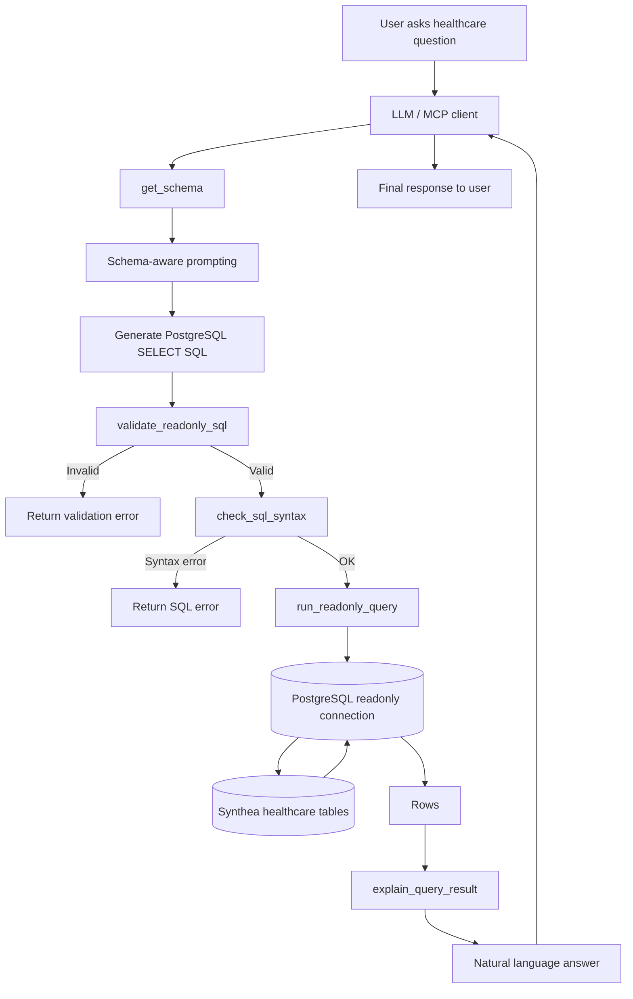
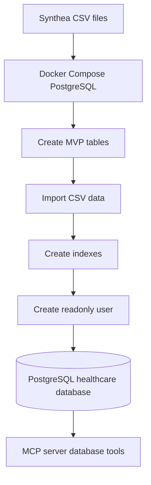
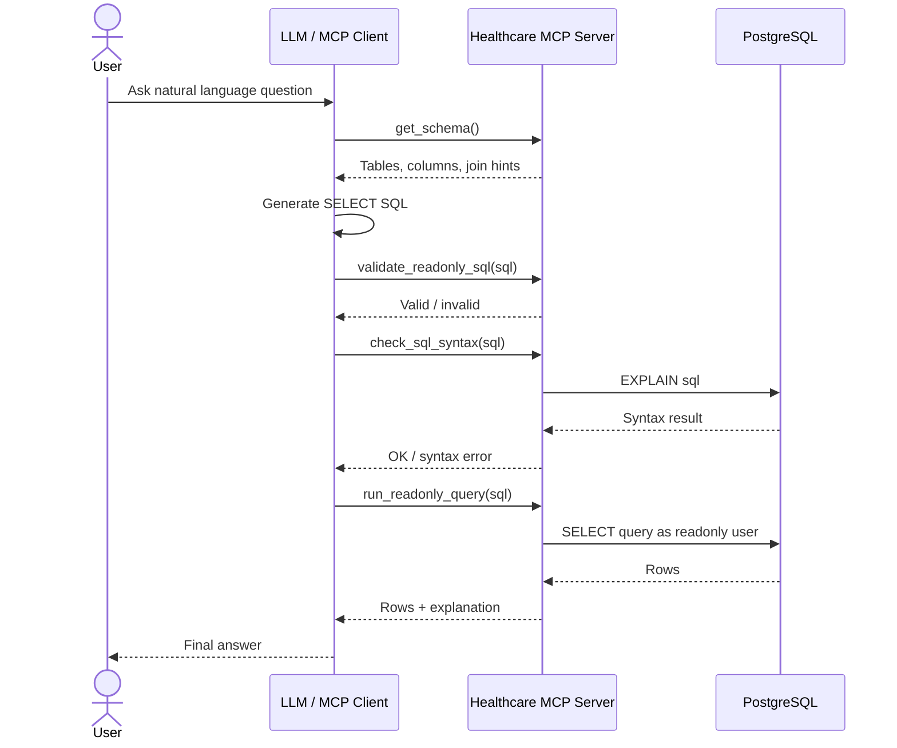
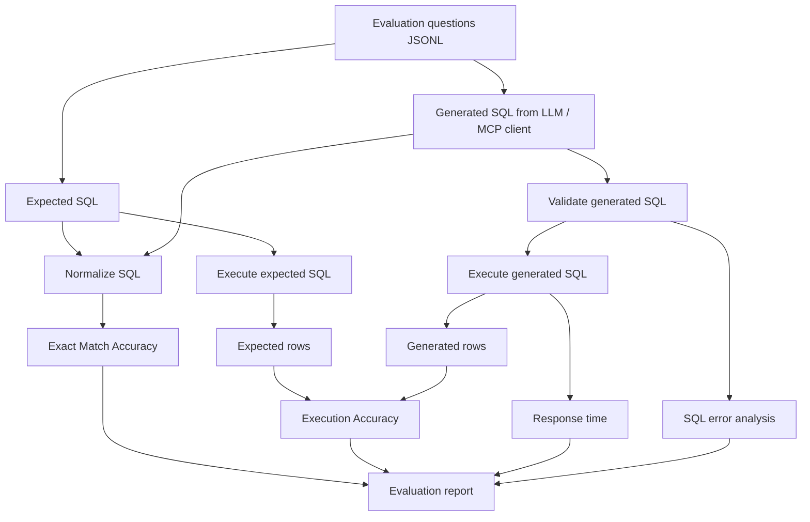

# Mermaid Flow

## Runtime Flow

```mermaid
flowchart TD
    A[User asks healthcare question] --> B[LLM / MCP client]
    B --> C[get_schema]
    C --> D[Schema-aware prompting]
    D --> E[Generate PostgreSQL SELECT SQL]
    E --> F[validate_readonly_sql]
    F -->|Invalid| G[Return validation error]
    F -->|Valid| H[check_sql_syntax]
    H -->|Syntax error| I[Return SQL error]
    H -->|OK| J[run_readonly_query]
    J --> K[(PostgreSQL readonly connection)]
    K --> L[(Synthea healthcare tables)]
    L --> K
    K --> M[Rows]
    M --> N[explain_query_result]
    N --> O[Natural language answer]
    O --> B
    B --> P[Final response to user]
```

## Data Import Flow

```mermaid
flowchart TD
    A[Synthea CSV files] --> B[Docker Compose PostgreSQL]
    B --> C[Create MVP tables]
    C --> D[Import CSV data]
    D --> E[Create indexes]
    E --> F[Create readonly user]
    F --> G[(PostgreSQL healthcare database)]
    G --> H[MCP server database tools]
```

## Tool Sequence

```mermaid
sequenceDiagram
    actor User
    participant Client as LLM / MCP Client
    participant MCP as Healthcare MCP Server
    participant DB as PostgreSQL

    User->>Client: Ask natural language question
    Client->>MCP: get_schema()
    MCP-->>Client: Tables, columns, join hints
    Client->>Client: Generate SELECT SQL
    Client->>MCP: validate_readonly_sql(sql)
    MCP-->>Client: Valid / invalid
    Client->>MCP: check_sql_syntax(sql)
    MCP->>DB: EXPLAIN sql
    DB-->>MCP: Syntax result
    MCP-->>Client: OK / syntax error
    Client->>MCP: run_readonly_query(sql)
    MCP->>DB: SELECT query as readonly user
    DB-->>MCP: Rows
    MCP-->>Client: Rows + explanation
    Client-->>User: Final answer
```

## Evaluation Flow

```mermaid
flowchart TD
    A[Evaluation questions JSONL] --> B[Expected SQL]
    A --> C[Generated SQL from LLM / MCP client]
    B --> D[Execute expected SQL]
    C --> E[Validate generated SQL]
    E --> F[Execute generated SQL]
    B --> G[Normalize SQL]
    C --> G
    G --> H[Exact Match Accuracy]
    D --> I[Expected rows]
    F --> J[Generated rows]
    I --> K[Execution Accuracy]
    J --> K
    F --> L[Response time]
    H --> M[Evaluation report]
    K --> M
    L --> M
    E --> N[SQL error analysis]
    N --> M
```
