# Mermaid Flow

Tài liệu này mô tả chi tiết các luồng runtime chính của hệ thống.

## 1. Docker Runtime Tổng Thể

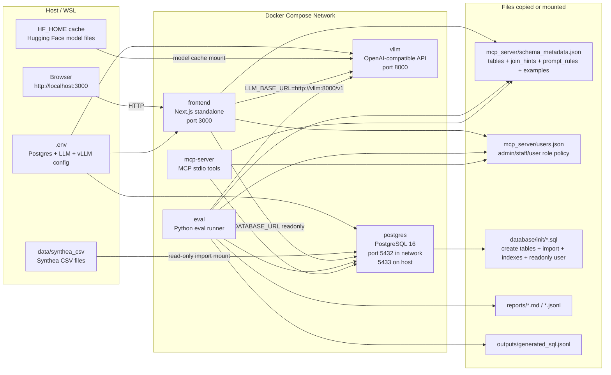

## 2. Frontend Runtime: Question Mode

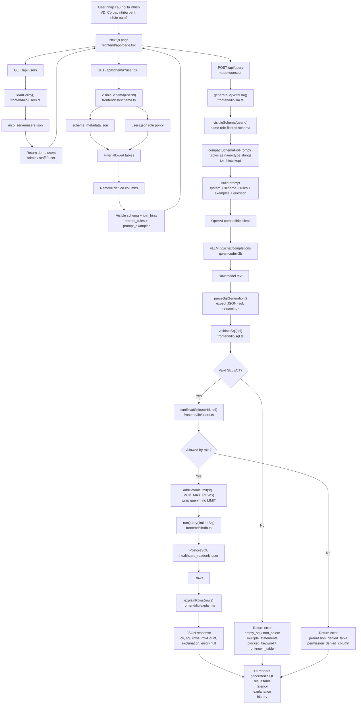

## 3. Frontend Runtime: SQL Manual Mode

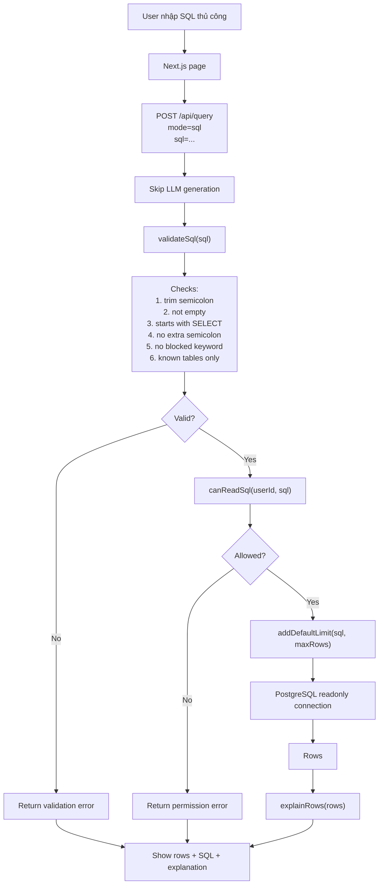

## 4. Schema-Aware Prompt Construction

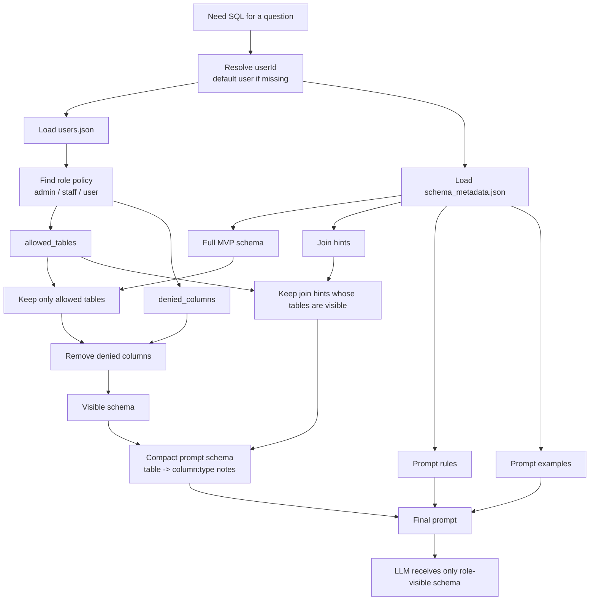

## 5. SQL Safety + RBAC Path

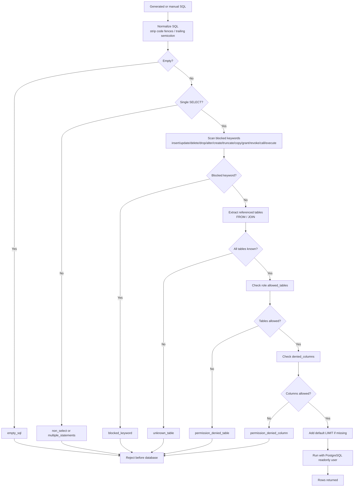

## 6. MCP Stdio Runtime

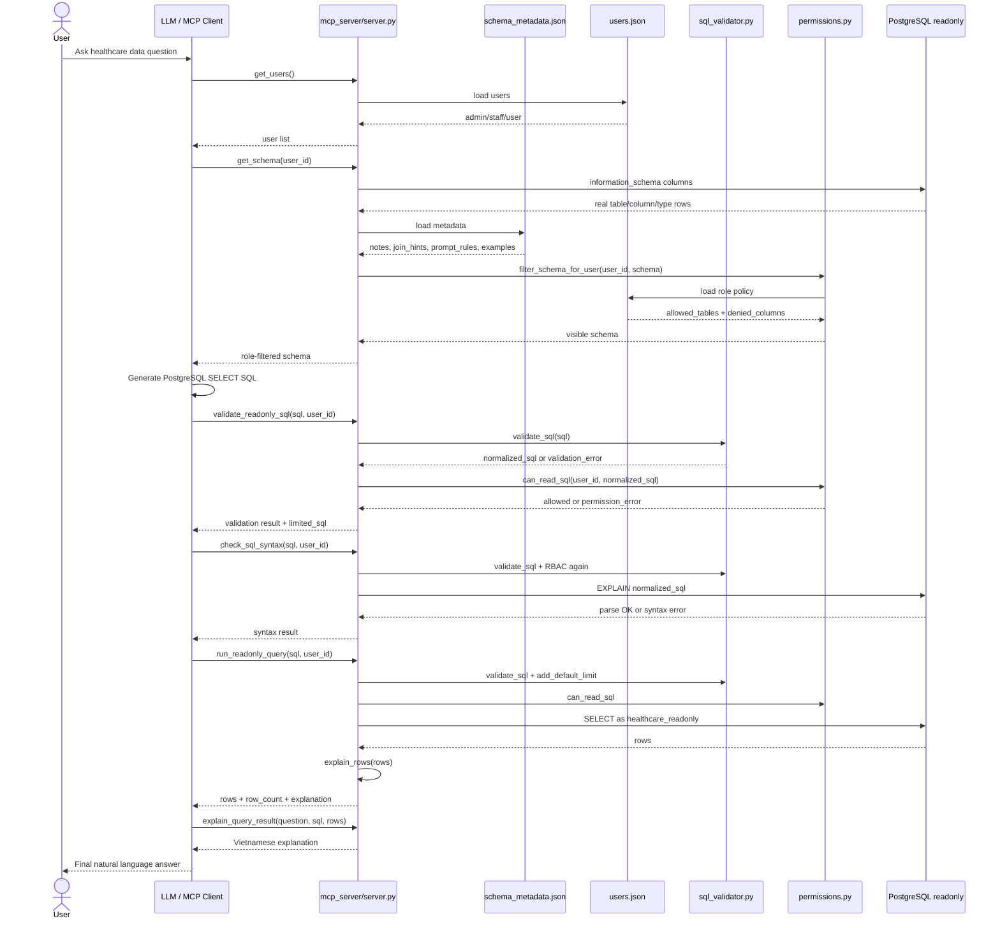

## 7. Data Import Runtime

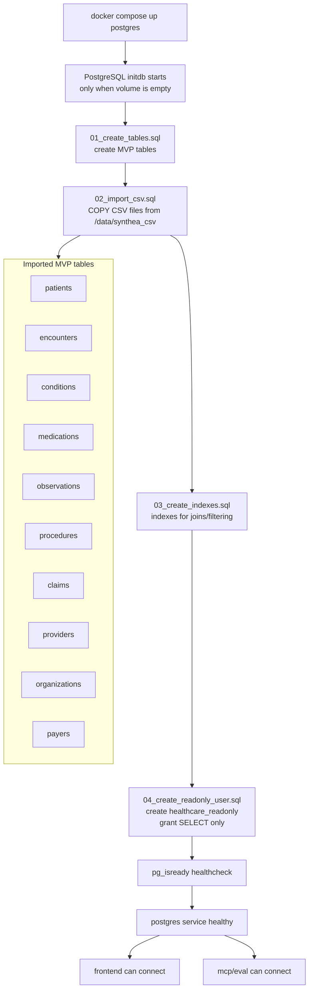

## 8. vLLM Startup Runtime

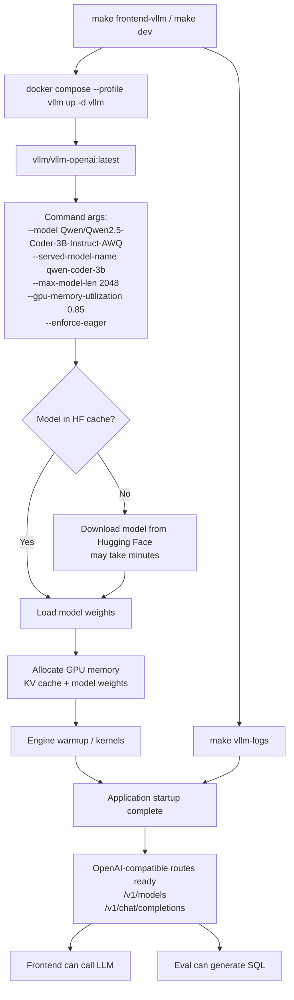

## 9. Eval-Gold Runtime

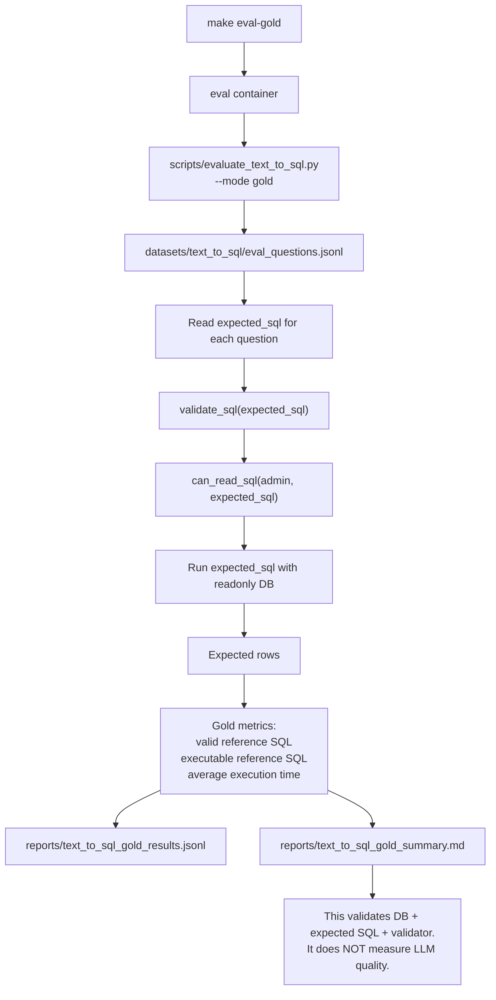

## 10. Eval-LLM Runtime

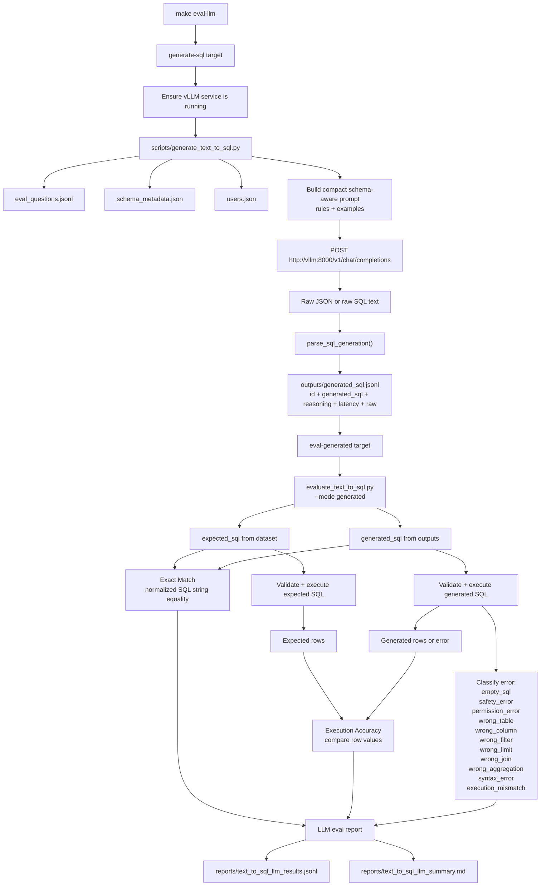

## 11. Error Handling Runtime

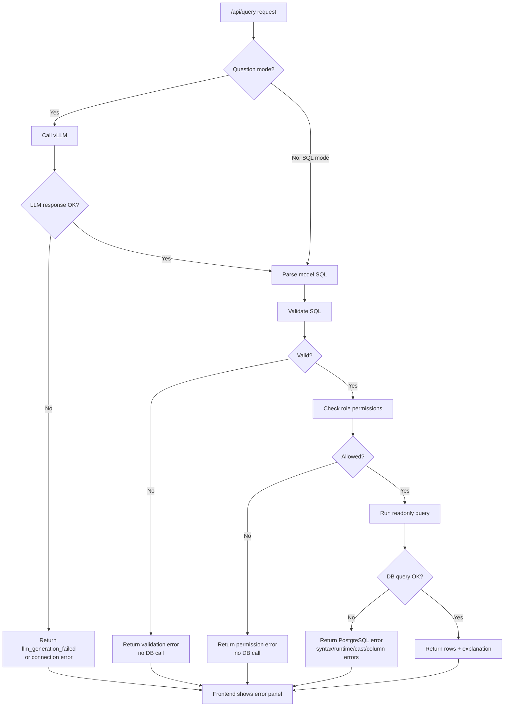

## 12. Role Permission Runtime

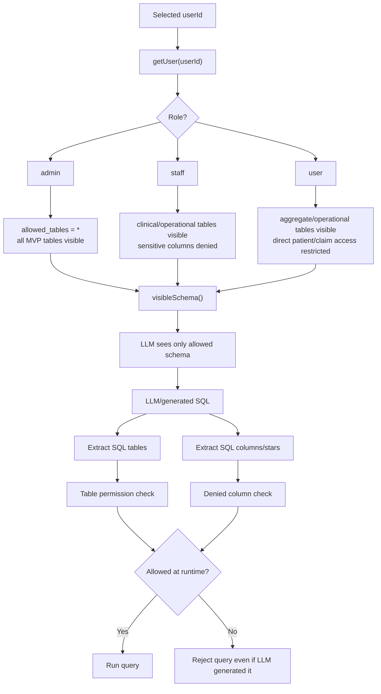

## 13. Current Architecture Boundary

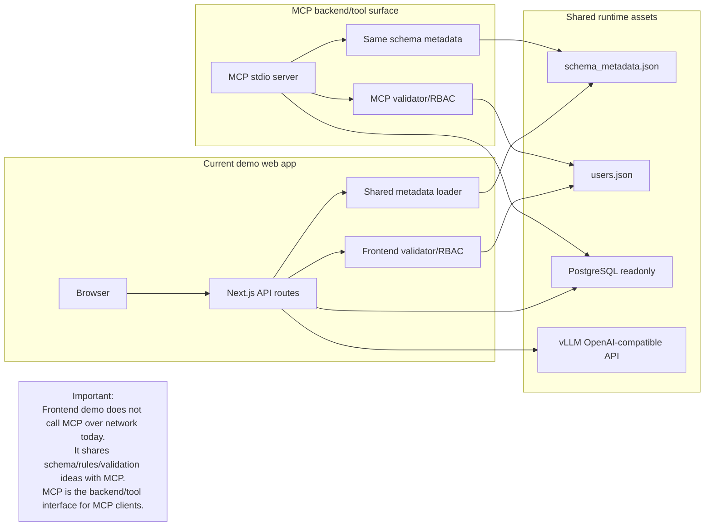
